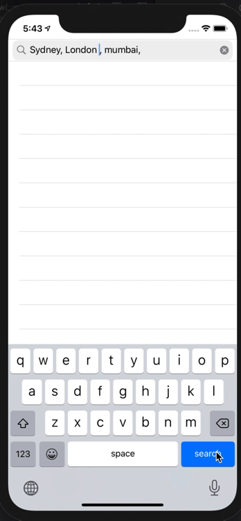

# FutureWeather
Know the weather of your city and search other cities 

Location from Simulator: 

When the app Launches The CoreLocation finds the device location and fetch the forecast weather for the next 5 Days with an iterval of 3 hours from the API of OpenWeather 

The user can simulate different location from the Xcode to check the weather forecast as shown below

---------------------------------------------------
Search for Cities:

The user can search for a minimum of 3 and max of 7 cities . The network call is made asyncroously for all cities and the fetched data is appended to the list and the table is reloaded. We can also wait for all the fetch request to complete and then reload the table. But that may give an impression of slow network response.

----------------------------------------------------
Unit Tests :

Run the unit test from the top bar to see the the unit test passing. The approch followed is TDD with Red Green Refactor with Depedency Injection to mock the service to speed up unit test. 

---------------------------------------------------
Code Coverage:

Go to Edit Scheme and unable the Code Coverage in order to see the code coverage as shown below`

